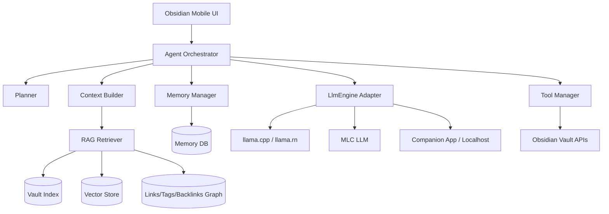
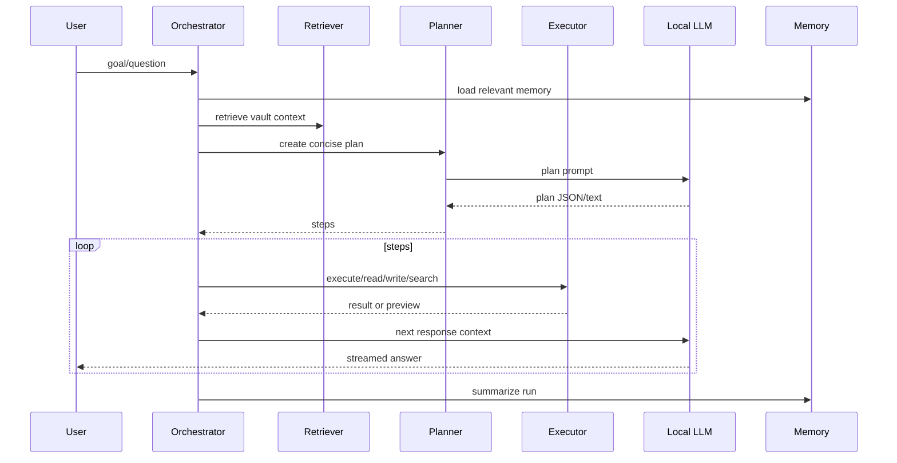

# Offline Claude-Style AI Agent for Obsidian Mobile

## Executive summary

A fully offline Obsidian Mobile agent can feel Claude-like in workflow, but not in raw intelligence. Claude-class behavior depends on frontier-scale cloud models, enormous serving infrastructure, proprietary training, and constantly updated safety/instruction tuning. A zero-budget Android plugin cannot reproduce that. The best free replacement is a local small language model plus excellent retrieval, memory, context compression, and careful tool orchestration.

The recommended MVP is an Obsidian plugin written in TypeScript that delegates generation to one of three local backends:

1. **Primary Android path:** a companion local engine based on `llama.cpp`/GGUF or `llama.rn` exposed through an Android bridge or localhost loopback.
2. **Experimental high-performance path:** MLC LLM for devices with compatible GPU/OpenCL/Vulkan support.
3. **Fallback path:** no-LLM mode with lexical search, templates, task extraction, smart backlinks, and summaries generated from deterministic extractive algorithms.

## Reality check

| Desired feature | Offline feasibility | Closest practical alternative |
|---|---:|---|
| Claude-level reasoning | Low | Qwen3 4B/8B, Phi-4 Mini, or DeepSeek-R1 Distill 1.5B/7B with planner prompts and verification loops. |
| 100k+ useful context on phone | Medium for model specs, low for quality/speed | Store long context in RAG; send only 2k-12k high-value tokens to the model. |
| Instant responses | Medium | Stream tokens, use 0.5B-3B models for quick actions, swap to 4B-8B for hard tasks. |
| Perfect vault memory | Medium | Incremental index over Markdown, embeddings when possible, BM25 fallback, conversation summaries. |
| Autonomous file operations | High with guardrails | Tool calls require previews and confirmation for destructive changes. |
| Offline voice | Medium | Android speech services if offline language packs exist, or optional local Whisper/Vosk companion. |

## Research findings: local LLM runtimes

| Runtime | Android/mobile compatibility | RAM/storage | Speed | Acceleration | License/offline | Recommendation |
|---|---|---|---|---|---|---|
| `llama.cpp` | Strong native C/C++; Android builds are common through Termux/custom NDK. | Model size plus KV cache; 1B Q4 around 0.8GB file, 3B Q4 around 2GB, 7B/8B Q4 around 4-5GB plus cache. | Best general CPU baseline; depends heavily on memory bandwidth. | CPU NEON; Vulkan can help on some Android GPUs but is device/driver sensitive. | MIT; fully offline. | Best universal core. |
| `llama.rn` | React Native binding to llama.cpp with prebuilt Android libraries. | Same as llama.cpp. | Similar to llama.cpp with JS/native overhead mostly outside token loop. | Native llama.cpp backends depending build. | MIT; fully offline. | Best reference for a companion mobile app or bridge. |
| MLC LLM | Native mobile deployment framework with Android history. | Compiled model artifacts; int4 models can fit phones. | Potentially faster than CPU llama.cpp when GPU path works. | OpenCL/Vulkan-class mobile GPU paths vary by device. | Apache-style project; offline. | Experimental performance path. |
| Ollama | Excellent desktop/server UX; Android is not its primary mobile runtime. | Same model constraints; daemon overhead. | Good on desktop, less practical in Obsidian Mobile. | Desktop GPU focus. | MIT; offline. | Use only when user runs a local LAN/Termux server. |
| PocketPal AI | Android/iOS app for on-device local models. | Supports small quantized local models. | Good UX for chat; integration depends on Android intents/localhost/plugin bridge availability. | Uses mobile local inference stack. | Open source; offline. | Best companion-app inspiration. |
| LM Studio | Desktop local model app. | Desktop-class. | Good desktop only. | Desktop GPU. | Free app, not ideal for mobile plugin. | Optional desktop sync/testing, not Android MVP. |
| KoboldCPP | llama.cpp-based desktop/server binary. | Desktop/server-class. | Good on desktop; Android possible only through ports/Termux. | CPU/GPU depending build. | Open source; offline. | Useful protocol reference, not mobile MVP. |
| Jan AI | Desktop local AI app. | Desktop-class. | Good desktop UX. | Desktop acceleration. | Open source; offline. | Not target for Obsidian Mobile. |
| GPT4All | Desktop SDK/app with local models. | Mostly desktop. | Good for desktop notes workflow. | CPU/GPU depends platform. | Open source; offline. | Not primary Android path. |
| llama.cpp Android ports | Community ports prove feasibility. | Phone must have enough free RAM and storage for quantized weights. | 0.5B-3B acceptable; 7B can be slow/hot. | CPU stable; GPU varies. | Usually open source/offline. | Good prototype source, but production should own the bridge. |

## Best small model ranking for Android

Use GGUF or mobile-compiled int4 where possible. Avoid non-commercial or ambiguous licenses for a broadly redistributable plugin; allow user-imported models with license warnings.

| Rank | Model family | Best mobile size | Reasoning | Speed | Memory | Writing | Coding | Notes |
|---:|---|---|---:|---:|---:|---:|---:|---|
| 1 | Qwen3 | 1.7B/4B/8B | High | Medium | Medium | High | High | Strong open-weight family; Apache 2.0 for Qwen3 open weights; thinking/non-thinking modes are useful. |
| 2 | Phi-4 Mini | 3.8B | High | Medium | Medium | Medium | Medium | Excellent compact reasoning and long context spec; check license terms before bundling. |
| 3 | Qwen2.5 Coder | 1.5B/7B | Medium | Medium | Medium | Medium | High | Best for code; Qwen2.5 3B has different license, so prefer 1.5B or 7B. |
| 4 | Gemma 3/Gemma small | 1B/4B | Medium | High | Good | High | Medium | Strong writing and long context, but Gemma license is not classic open source. User-download only. |
| 5 | DeepSeek-R1 Distill | 1.5B/7B | High | Low-Med | Medium | Medium | Medium | Good explicit reasoning behavior; can be verbose/slow. Hide scratchpad; ask for concise answers. |
| 6 | SmolLM/SmolLM2 | 360M/1.7B | Low-Med | High | Excellent | Medium | Low-Med | Great tiny fallback and classification/extraction. |
| 7 | TinyLlama | 1.1B | Low | High | Excellent | Low-Med | Low | Legacy fallback only. |
| 8 | Mistral Small | 7B+ class or larger variants | High | Low on phones | Poor-Med | High | High | Excellent if hardware allows, but usually too heavy for mobile. |
| 9 | Llama 3.x small variants | 1B/3B/8B | Medium-High | Medium | Medium | High | Medium | Good quality; license is not OSI open source, so do not bundle by default. |

Recommended defaults:

- **Low RAM, 4-6GB phone:** SmolLM2 1.7B Q4 or Qwen2.5 1.5B Q4, 2k-4k context.
- **Mid phone, 6-8GB:** Qwen3 1.7B/4B Q4, Phi-4 Mini Q4, 4k-8k context.
- **High-end, 12GB+:** Qwen3 8B Q4 or Qwen2.5 Coder 7B Q4, 8k-16k context, with thermal throttling.

## Architecture diagram



```text
User action -> UI command -> AgentRun
  -> retrieve vault context
  -> load conversation and long-term memories
  -> build compact prompt
  -> stream model output
  -> parse tool proposals
  -> preview file edits
  -> apply approved changes
  -> summarize run into memory
```

## Plugin feature design

### User surfaces

- **Chat sidebar:** persistent assistant conversation with source citations to notes.
- **Floating assistant:** small modal over the active note for quick questions.
- **Inline AI:** select text, then summarize, rewrite, continue, extract tasks, or create backlinks.
- **Command palette:** `Ask Offline Assistant`, `Index Vault`, `Summarize Note`, `Suggest Links`, `Plan Project`.
- **Slash commands:** `/summarize`, `/link`, `/tasks`, `/daily`, `/rewrite`, `/explain`, `/code`, `/organize`.
- **Daily note assistant:** extracts tasks, unfinished items, calendar-like Markdown entries, and reflections.
- **Smart backlinks:** suggests notes to link using hybrid semantic and lexical similarity.
- **Auto tagging/linking:** opt-in only; preview before changes.
- **Voice input:** optional Android offline speech recognition; fallback to keyboard.

### Folder structure

```text
obsidian-offline-agent/
  manifest.json
  package.json
  esbuild.config.mjs
  src/
    main.ts
    types.ts
    settings.ts
    events.ts
    ui/
      ChatView.ts
      FloatingAssistant.ts
      InlineActions.ts
      SettingsTab.ts
    agent/
      AgentOrchestrator.ts
      Planner.ts
      Executor.ts
      Reflection.ts
      PromptBuilder.ts
      ContextBuilder.ts
    engines/
      LlmEngine.ts
      LlamaCppEngine.ts
      LlamaRnBridge.ts
      MlcEngine.ts
      CompanionHttpEngine.ts
      MockEngine.ts
    memory/
      MemoryManager.ts
      ConversationStore.ts
      LongTermMemoryStore.ts
      Summarizer.ts
    rag/
      VaultIndexer.ts
      Chunker.ts
      EmbeddingService.ts
      HybridRetriever.ts
      VectorStore.ts
      GraphStore.ts
      Ranker.ts
    tools/
      ToolManager.ts
      ReadNoteTool.ts
      WriteNoteTool.ts
      SearchVaultTool.ts
      LinkTool.ts
      TaskTool.ts
    storage/
      SqliteAdapter.ts
      JsonStore.ts
      Encryption.ts
    mobile/
      BatteryPolicy.ts
      ModelManager.ts
      ThermalPolicy.ts
    prompts/
      system.ts
      planner.ts
      summarizer.ts
  docs/
    offline-obsidian-agent-architecture.md
```

## Core TypeScript design

The initial shared contracts live in [`src/types.ts`](../src/types.ts). The key abstraction is `LlmEngine`: every backend must implement availability checks, model loading, model unloading, streaming generation, and optionally embeddings. This keeps Obsidian UI, RAG, and memory independent from inference technology.

## Memory system

### Layers

1. **Short-term conversation memory:** recent messages, pinned user instructions, active note, open pane state.
2. **Rolling summaries:** every N turns, summarize decisions, preferences, unresolved tasks, and note references.
3. **Long-term memory:** user-approved facts/preferences/project states stored as Markdown or local database records.
4. **Vault memory:** indexed note chunks, tags, links, backlinks, headings, aliases, frontmatter, and modified time.
5. **Task memory:** extracted TODOs from Markdown task syntax, daily notes, and project notes.

### Memory write policy

- Never silently store sensitive inferred facts.
- Classify candidate memories as preference, project fact, task state, or reflection.
- Ask for confirmation for durable personal facts.
- Allow a `Forget this` command that deletes conversation summaries, embeddings, and long-term memory records.

## Offline RAG architecture

### Chunking algorithm

```pseudo
for each markdown file changed since last index:
  parse frontmatter, headings, links, tags, tasks
  split by heading sections
  for each section:
    create chunks of 300-700 tokens with 60-token overlap
    keep heading path, line numbers, tags, links, mtime
    compute embedding if local embedding engine exists
    store lexical terms for BM25 fallback
    update graph edges for links/backlinks/tags
```

### Retrieval algorithm

```pseudo
function retrieve(query, activeFile, limit):
  lexical = bm25.search(query, 50)
  semantic = vector.search(embed(query), 50) if embeddingsEnabled else []
  graph = relatedChunks(activeFile, tags, backlinks, 30)
  candidates = merge(lexical, semantic, graph)
  score = 0.45 * semanticScore + 0.35 * bm25Score + 0.10 * graphScore + 0.10 * recencyScore
  diversify by file path and heading
  rerank top 20 with tiny cross-encoder if available, else heuristic
  return top limit with citations
```

### Embedding choices

- **Best quality:** small local sentence-transformer converted to ONNX, e.g. MiniLM/E5-small class.
- **Most mobile friendly:** lexical BM25 plus note graph when embeddings are too expensive.
- **Experimental:** use the LLM embedding output if backend supports embeddings efficiently.
- **Storage:** float16/int8 vectors; batch indexing while charging; pause on battery saver.

## Agent architecture



### Planner

- Converts a user request into 1-7 visible steps.
- Uses hidden internal notes in memory, but final answer exposes only concise rationale and actions.
- Does not expose chain-of-thought; prompts ask for short plans and final answers.

### Executor and tools

Read-only tools can run automatically. Write, move, delete, or bulk-edit tools require preview and confirmation. On mobile, destructive actions should be disabled by default.

### Error recovery

- If model output is malformed, repair JSON with a strict parser or fall back to text mode.
- If context is too large, summarize retrieved chunks and retry.
- If model load fails, offer a smaller model profile.
- If indexing overheats or battery saver is on, pause and resume later.

## Prompt strategy

### System prompt excerpt

```text
You are an offline Obsidian vault assistant. You run locally on the user's device.
Use only provided context and clearly mark uncertainty. Do not claim cloud access.
For note edits, propose a preview before changing files. Do not reveal hidden reasoning.
Return concise plans, then helpful final answers with note citations when available.
```

### Context packing order

1. System/developer policy.
2. Current note selection and metadata.
3. User request.
4. Relevant long-term memories.
5. Top retrieved chunks with paths and line ranges.
6. Recent conversation summary.
7. Tool schemas.
8. Response format instruction.

## Mobile optimization

- **Quantization:** default Q4_K_M/int4; allow Q2/Q3 on low RAM; Q5/Q8 only on high-end devices.
- **Lazy loading:** load model only when chat opens; unload after inactivity.
- **Model swapping:** tiny model for tags/tasks, larger model for reasoning.
- **Streaming:** render tokens immediately and allow cancellation.
- **Context budget:** cap prompt to device tier; prefer retrieval over long raw context.
- **Incremental indexing:** file watcher queues changed Markdown only.
- **Battery policy:** index only while charging by default; stop on low battery/thermal warning.
- **Cache:** cache embeddings, summaries, token counts, and retrieval results per file mtime.
- **Startup:** defer model discovery and indexing until UI idle.
- **Threading:** use native worker/companion process for inference; never block Obsidian UI thread.

## Security and privacy

- No network calls by default; add a settings toggle that blocks all HTTP except `127.0.0.1` if a companion server is used.
- Store model files and indexes in the vault plugin data directory or user-selected local folder.
- Encrypt long-term memory and conversation logs if the user sets a passphrase.
- Never index excluded folders such as `.git`, `.obsidian/plugins`, private folders, or user-configured globs.
- Provide `Delete all AI data`: removes conversations, summaries, vectors, caches, and memories.
- Tool permissions are explicit: read notes, write notes, rename/move notes, delete notes, run external companion.

## Development roadmap

### Milestone 1: Research and skeleton

- Create Obsidian plugin shell, settings, chat view, command palette commands.
- Implement `MockEngine`, chunker, BM25 search, and read-only note Q&A.

### Milestone 2: MVP offline assistant

- Add companion `llama.cpp`/GGUF integration instructions.
- Stream chat responses.
- Index Markdown incrementally.
- Summarize active note and answer questions with citations.

### Milestone 3: Memory and tools

- Conversation summaries.
- User-approved long-term memories.
- Smart backlinks, tags, and task extraction.
- Preview-based note edits.

### Milestone 4: Advanced mobile optimization

- Embeddings with ONNX or backend-native vectors.
- Device-tier model recommendations.
- Battery/thermal policies.
- Model manager and benchmark screen.

### Milestone 5: Claude-like workflows

- Planner/executor loop.
- Multi-note research synthesis.
- Project planning from vault context.
- Writing/code assistant modes.
- Reflection and self-check passes.

## Testing strategy

- Unit tests: chunking, link extraction, frontmatter parsing, retrieval scoring, prompt packing.
- Integration tests: index a sample vault, retrieve known facts, apply preview edits, rollback edits.
- Mobile tests: low-memory model load failure, cancellation, app background/foreground, vault sync conflicts.
- Privacy tests: assert no outbound network requests in offline mode.
- Golden prompt tests: ensure no hidden reasoning is requested or displayed.

## Benchmarks

Track per device tier:

| Benchmark | Target low-end | Target mid | Target high-end |
|---|---:|---:|---:|
| Plugin cold UI startup | < 2s | < 1.5s | < 1s |
| Incremental index single note | < 500ms | < 250ms | < 150ms |
| Retrieval top 8 | < 800ms | < 400ms | < 200ms |
| First token after model loaded | < 8s | < 4s | < 2s |
| Generation speed 1B Q4 | 3-8 tok/s | 8-15 tok/s | 15+ tok/s |
| Generation speed 4B Q4 | 0.5-3 tok/s | 3-8 tok/s | 8+ tok/s |

These are aspirational and must be measured on real phones; thermal throttling can halve sustained speed.

## Deployment guide

1. Build and install the Obsidian plugin manually in `.obsidian/plugins/offline-agent`.
2. Download a compatible quantized model from a trusted source while on Wi-Fi.
3. Place the model in the configured local model folder.
4. Select device tier and model profile in settings.
5. Run `Index Vault` while charging.
6. Open Chat sidebar and ask a question about the active note.
7. Enable advanced tools only after confirming backups/sync are working.

## Trade-offs

| Decision | Benefit | Cost |
|---|---|---|
| Local model only | Privacy and zero cost | Lower quality and slower than Claude. |
| Plugin + companion engine | Feasible on Android despite JS sandbox | More setup complexity. |
| Hybrid BM25/vector RAG | Works even without embeddings | More code and ranking tuning. |
| Preview edits | Safer file operations | Less autonomous. |
| User-supplied models | Avoids redistribution/license issues | Harder onboarding. |
| Small default model | Runs on more phones | Weaker reasoning/writing. |

## Recommended open-source libraries

- Obsidian API for plugin UI and vault operations.
- `llama.cpp` for GGUF local inference.
- `llama.rn` and PocketPal AI as mobile implementation references.
- MLC LLM as an optional GPU/mobile compiler path.
- FlexSearch/MiniSearch or a small BM25 implementation for lexical retrieval.
- ONNX Runtime Mobile or Transformers.js-compatible embeddings only if Obsidian Mobile packaging permits it.
- `sql.js`, SQLite plugin storage, or compact JSONL shards for indexes depending on platform constraints.
- `zod` for settings/tool schema validation.

## Example workflows

### Ask about the active note

1. User selects text and runs `Ask Offline Assistant`.
2. Context builder adds selection, note metadata, backlinks, and top chunks.
3. Model answers with citations and uncertainty markers.

### Create smart backlinks

1. Chunker embeds or lexically indexes the current note.
2. Retriever finds semantically similar notes and existing aliases.
3. Assistant proposes Markdown links with line previews.
4. User approves selected changes.

### Plan a project

1. User asks: `Plan next actions for Project Atlas`.
2. Retriever gathers project notes, tasks, meetings, and daily notes.
3. Planner creates phases and task list.
4. Executor writes a preview into the project note.
5. Memory manager stores the project state summary.

## Future improvements

- Local multimodal OCR for images/PDFs when mobile hardware allows it.
- Fine-tuned small model for Obsidian-specific tool calls.
- Federated benchmark sharing with no vault content included.
- Optional LAN-only desktop accelerator using the user's own computer.
- Better offline speech with Vosk/Whisper.cpp companion.
